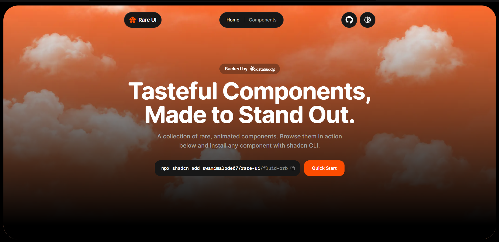

<!-- <a href="https://oxygenui.com">
  
</a> -->

<div align="center">

# Oxygen-UI

**A shadcn registry of ready-to-use components and animations.**


[**oxygenui.com**](https://oxygenui.com) &nbsp;&middot;&nbsp; [Components](https://oxygenui.com/components) &nbsp;&middot;&nbsp; [Follow on X](https://x.com/swamimalode)

</div>

<br />

Oxygen-UI is a shadcn registry built with Next.js, Tailwind CSS, and TypeScript. Every component is animated with Motion, honors `prefers-reduced-motion`, and installs straight into your codebase. You own the code: no package to depend on, restyle anything.

## Quick start

Install any component with the shadcn CLI:

```bash
npx shadcn@latest add Subhan-code/oxygen_ui/{component-name}
```

For example:

```bash
npx shadcn@latest add Subhan-code/oxygen_ui/bounce-sidebar
```

Browse every component, with live previews and props, at [oxygenui.com/components](https://oxygenui.com/components).

## Running locally

```bash
git clone https://github.com/Subhan-code/oxygen_ui.git
cd oxygen_ui
npm install
npm run dev
```

Components live in `components/ui`. After changing a component or `registry.json`, rebuild the registry output with `npm run registry:build`.

## Contributing

Issues and pull requests are welcome. Read [CONTRIBUTING.md](CONTRIBUTING.md) for the full walkthrough, from creating a component to a working install command.

<div align="center">
  <br />
  
  <p><sub>Built by Founder <a href="https://x.com/SubhanHQ">Syed Subhan (@SubhanHQ)</a></sub></p>
</div>
